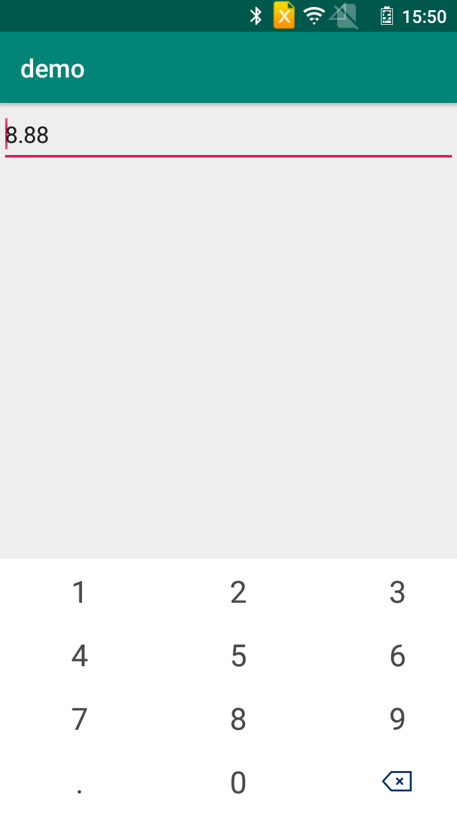

# NumKeyBorad
一个简单灵活高度可配置的安卓自定义键盘，a simple  flexible configurable keyboad for android

# 相比原生安卓自定义键盘增加了按键颜色,按键图片等等
# 效果图

# 用法
## xml 节点属性说明
*   ckeyboard 键盘跟节点   csk_bg_color键盘背景色属性 csk_t_color键盘按键颜色属性 csk_t_size键盘按键全局大小 height键盘高度属性 width键盘宽度属性
*   row  键盘行节点        height键盘行高属性
*   key  按键节点          height按键高度属性 width按键宽度属性 k_code按键keyCode属性 k_text按键显示属性 k_icon按键显示图片属性 press_color按键按下属性
*   keys 按键数组节点      splitter按键数组分割字符属性,通过该属性将keys按键数组属性中的数组内容分割 最终渲染成多个按键key
## 单位说明
* %p                       按百分比
* %sp                      按sp
* %dp                      按dp
1. 配置xml  

```xml
<?xml version="1.0" encoding="utf-8"?>
<ckeyboard    
      
    csk_bg_color="@color/bgColor" 
    
    csk_t_color="@color/softKeyColor" 
    
    csk_t_size="24%sp" 
  
    height="100%p" 

    start_x="0%p" 

    start_y="0%p" 

    width="100%p"> 
 
    <row height="25%p"> 
        
        <keys  
            height="25%p"
            
            ks_codes="1|2|3" 
            ks_t_size="24%sp"
           
            ks_texts="1|2|3"   
           
            press_color="@color/softKeyColor" 
            
            splitter="|"   
            width="33%p"></keys>
    </row>
    <row height="25%p">
        <keys
            height="25%p"
            ks_codes="4|5|6"
            ks_t_size="24%sp"
            ks_texts="4|5|6"
            press_color="@color/softKeyColor"
            splitter="|"
            width="33%p"></keys>
    </row>
    <row height="25%p">
        <keys
            height="25%p"
            ks_codes="7|8|9"
            ks_t_size="24%sp"
            ks_texts="7|8|9"
            press_color="@color/softKeyColor"
            splitter="|"
            width="33%p"></keys>
    </row>
    <row height="25%p">
        <keys
            height="25%p"
            ks_codes="-10|0"
            ks_t_size="24%sp"
            ks_texts=".|0"
            press_color="@color/softKeyColor"
            splitter="|"
            width="33%p"></keys>
        
        <key 
            height="25%p"
            k_code="-9"
            k_icon="@mipmap/ic_del"  
            k_size="24%sp"
            press_color="@color/softKeyColor"
            width="33%p"></key>
    </row>

</ckeyboard>

```

```kotlin
val keyBoardUtil = KeyBoardUtil(applicationContext, R.layout.keyboardview, R.xml.num_pad)
        keyBoardUtil.applyToEdit(edit_text) //应用到对应的EditText
        keyBoardUtil.mKeyClickIntercept = { keyCode, keyText, editTextContent ->
            // click keyboard do something yhongm
            //按键点击,处理按键点击事件
            var resultStr = handleKeyBoard(keyCode, keyText, editTextContent)
            if (resultStr != "error") {
                resultStr
            } else {
                editTextContent
            }

        }
        keyBoardUtil.mTextChangeListener = {
        //editText内容变化
            // text change do something yhongm
        }
```
